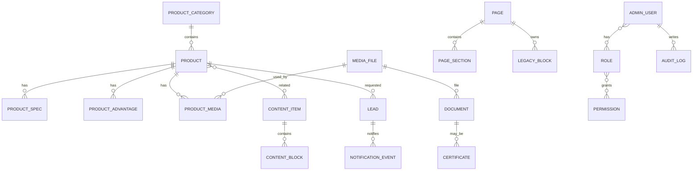

# Master Architecture

## Назначение

Документ фиксирует целевую архитектуру системы, основанную на повторном аудите `landing-web` и утвержденных бизнес/технических решениях.

## Текущее состояние

`landing-web` - React/Ionic/Vite SPA для публичного сайта ФКИТ/kitexp.ru. Фактические маршруты заданы в `src/App.tsx`:

| Route | Page | Notes |
| --- | --- | --- |
| `/`, `/equipment` | `EquipmentPage` | каталог, стартовая страница |
| `/equipment/:id` | `ProductDetailPage` | карточка оборудования по existing ID |
| `/information` | `InformationPage` | новости/статьи с табами и hash anchors |
| `/news` | redirect to `/information#news` | compatibility route |
| `/news/:id` | `NewsArticlePage` | детальная новость/статья по existing ID |
| `/about` | `AboutPage` | о компании |
| `/contacts` | `ContactsPage` | контакты и форма |
| `/privacy-policy` | `PrivacyPolicyPage` | статический legal text |
| `/home` | `HomePage` | legacy page, сохранить |
| `*` | `NotFoundPage` | 404 |

Фактический frontend-стек:

- React `19.2.0`;
- Ionic React `8.7.8`;
- React Router `6.30.1`;
- TypeScript `5.9.3`;
- Vite `7.1.7`;
- CSS Modules;
- Docker/nginx static deployment;
- tests отсутствуют.

## Источники данных сейчас

- Runtime JSON: S3 через `src/utils/fetchStaticData.ts`.
- Local JSON copies: `src/data`, `src/data_v2`; использовать только для сравнения.
- Hardcode: `Header`, `Footer`, `ContactInfo`, `AboutPage`, `PrivacyPolicyPage`, legacy components.
- Forms: direct browser calls to Telegram Bot API or Bitrix24 webhook in `CooperationForm`.
- Analytics: Yandex Metrika in `index.html`.
- Media: S3 paths in JSON and public assets for logo/favicon.

## Проблемы

- данные разбросаны между S3 JSON, JSX hardcode и локальными файлами;
- frontend содержит потенциальные integration secrets через `VITE_*`;
- нет backend validation, RBAC, audit, draft/archive, safe media management;
- нет admin panel;
- `/home` legacy не должен исчезнуть, но должен быть помечен deprecated;
- SEO ограничен SPA-подходом;
- тесты отсутствуют.

## Принятые решения

- Backend: Java 21, Spring Boot 3.x, PostgreSQL, Flyway, Spring Security, OpenAPI.
- Architecture: modular monolith, не микросервисы.
- Gateway: MVP internal edge layer inside `w-backend-service`; отдельный `w-api-gateway` не деплоится.
- Data: S3 current source for migration; PostgreSQL structured source after migration; S3 remains binaries source.
- IDs: сохранить existing IDs; добавить nullable `slug` только future extension.
- Routes: сохранить `/home` и `/news/:id`.
- i18n: не входит в MVP.
- Roles: `ADMIN`, `FEATURE_OWNER`, `CONTENT_READER`.
- Status: `DRAFT`, `ACTIVE`, `ARCHIVED`; для простых справочников допустим `active`.
- Notifications: email MVP; Telegram stub disabled; Bitrix future adapter only.
- Production: single VPS baseline, Docker Compose, no Kubernetes.

## Целевая архитектура

```text
landing-web        -> /api/v1/public/** -> w-backend-service edge layer -> modules -> PostgreSQL/S3/SMTP
w-admin-web       -> /api/v1/auth/**, /api/v1/admin/** -> same backend
w-api-contracts   -> OpenAPI source for generated clients and contract tests
w-data-migrator   -> reads current S3 JSON/files -> imports into PostgreSQL and media metadata
w-platform-infra  -> local Docker Compose and future VPS baseline
```

## Backend modules

`auth`, `user`, `rbac`, `catalog`, `content`, `page`, `legacy`, `menu`, `slide`, `contact`, `media`, `document`, `certificate`, `lead`, `notification`, `setting`, `audit`, `migration`, `storage`, `common`.

## Data model summary

Core entities: admin users, roles, permissions, audit logs, products, product categories, specs, advantages, media, videos, related content, content items, content blocks, pages, page sections, legacy blocks, menus, slides, contacts, documents, certificates, leads, notifications, settings.



## API

Public API prefixes:

- `GET /api/v1/public/site`
- `GET /api/v1/public/menu/{code}`
- `GET /api/v1/public/pages/{route}`
- `GET /api/v1/public/products`
- `GET /api/v1/public/products/{id}`
- `GET /api/v1/public/product-categories`
- `GET /api/v1/public/content`
- `GET /api/v1/public/news/{id}`
- `GET /api/v1/public/slides`
- `GET /api/v1/public/contacts`
- `GET /api/v1/public/documents`
- `GET /api/v1/public/certificates`
- `POST /api/v1/public/leads`

Auth API: `/api/v1/auth/login`, `/refresh`, `/logout`, `/me`.

Admin API: CRUD endpoints under `/api/v1/admin/**`.

## Admin panel

`w-admin-web` manages dashboard, catalog, categories, content, pages, legacy blocks, slides, media, documents, certificates, leads, users, audit, settings. UI stack: React, TypeScript, Vite, React Router, TanStack Query, React Hook Form, Zod, OpenAPI-generated client, Ant Design.

## S3, PDF, files

S3 stores binaries only after migration. PostgreSQL stores metadata and links. PDF supported through document/certificate modules: upload, preview, download, replace, archive, safe delete.

## Lead flow

User submits form -> public API -> validation + consent + anti-spam -> PostgreSQL lead -> notification event -> email sender -> delivery status -> admin view/retry.

## Security

Spring Security, cookie-based admin session or access/refresh token with httpOnly cookies, CSRF for cookie writes, CORS allowlist, rate limiting, request ID, secure headers, MIME validation, audit logs, secret isolation.

## Migration

`w-data-migrator` reads current S3, not local JSON as source of truth. It preserves existing IDs, does dry-run, validates schemas, imports metadata, reports broken references, and is idempotent.

## MVP criteria

MVP is ready when public frontend reads from API, admin can manage MVP content, leads are stored and emailed, S3 files are managed safely, data migration is verified, and contract/backend/frontend/admin smoke tests pass.

