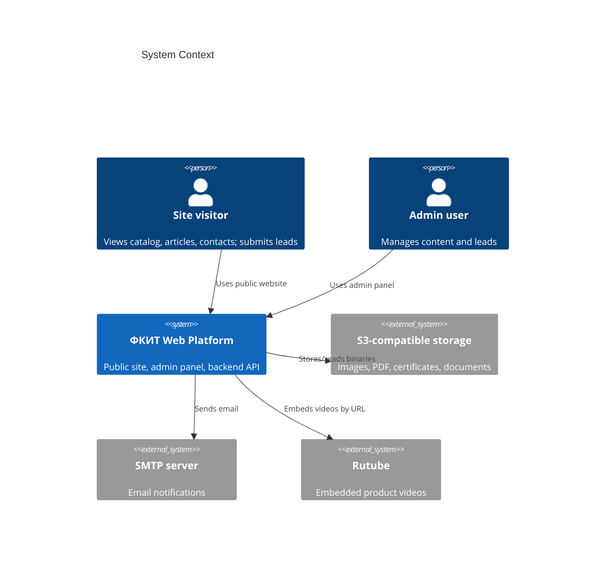
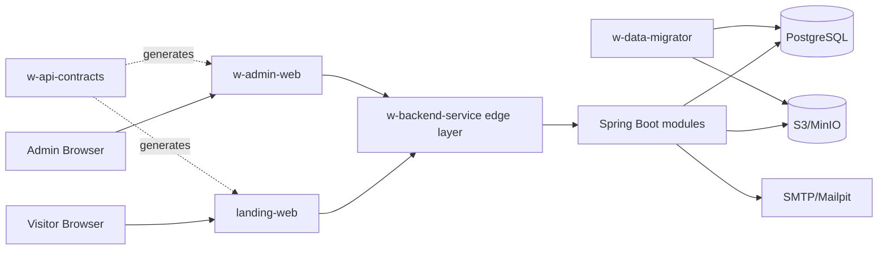
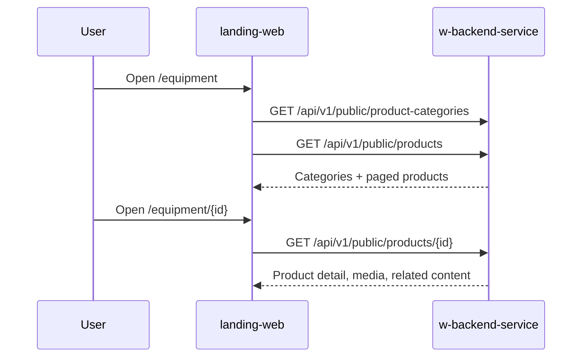
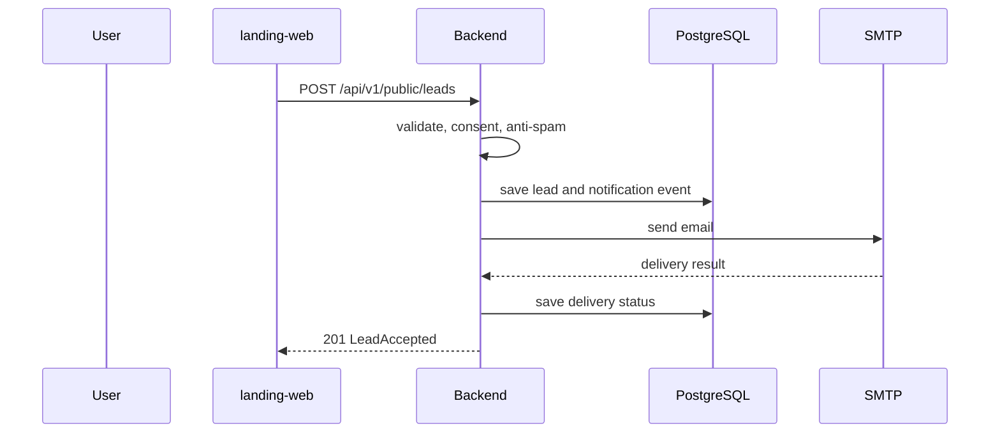
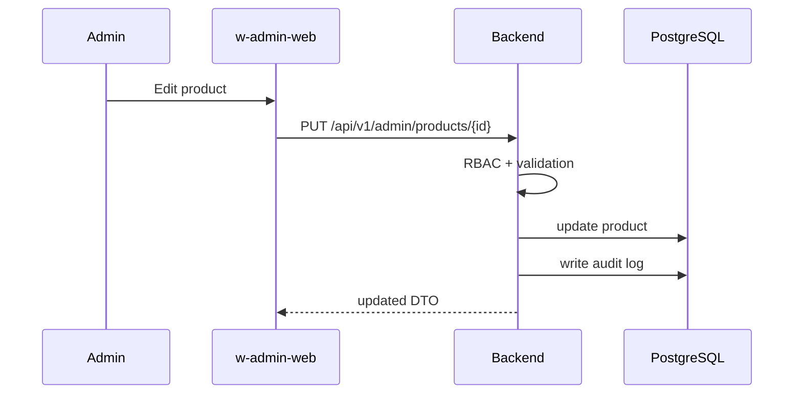
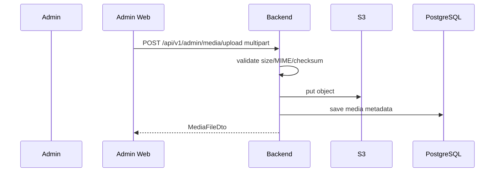
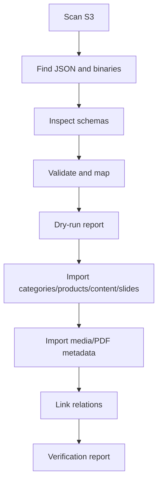

# System Context

## C4 System Context

```mermaid
C4Context
  title System Context
  Person(visitor, "Site visitor", "Views catalog, articles, contacts; submits leads")
  Person(admin, "Admin user", "Manages content and leads")
  System(system, "ФКИТ Web Platform", "Public site, admin panel, backend API")
  System_Ext(s3, "S3-compatible storage", "Images, PDF, certificates, documents")
  System_Ext(smtp, "SMTP server", "Email notifications")
  System_Ext(rutube, "Rutube", "Embedded product videos")
  Rel(visitor, system, "Uses public website")
  Rel(admin, system, "Uses admin panel")
  Rel(system, s3, "Stores/reads binaries")
  Rel(system, smtp, "Sends email")
  Rel(system, rutube, "Embeds videos by URL")
```

## C4 Container Diagram

```mermaid
flowchart LR
  visitor[Visitor Browser] --> lw[landing-web]
  admin[Admin Browser] --> aw[w-admin-web]
  lw --> api[w-backend-service edge layer]
  aw --> api
  api --> modules[Spring Boot modules]
  modules --> pg[(PostgreSQL)]
  modules --> s3[(S3/MinIO)]
  modules --> smtp[SMTP/Mailpit]
  contracts[w-api-contracts] -. generates .-> lw
  contracts -. generates .-> aw
  migrator[w-data-migrator] --> s3
  migrator --> pg
```

## User Flows

### Product browsing

```mermaid
sequenceDiagram
  participant U as User
  participant F as landing-web
  participant B as w-backend-service
  U->>F: Open /equipment
  F->>B: GET /api/v1/public/product-categories
  F->>B: GET /api/v1/public/products
  B-->>F: Categories + paged products
  U->>F: Open /equipment/{id}
  F->>B: GET /api/v1/public/products/{id}
  B-->>F: Product detail, media, related content
```

### Lead flow

```mermaid
sequenceDiagram
  participant U as User
  participant F as landing-web
  participant B as Backend
  participant DB as PostgreSQL
  participant SMTP as SMTP
  F->>B: POST /api/v1/public/leads
  B->>B: validate, consent, anti-spam
  B->>DB: save lead and notification event
  B->>SMTP: send email
  SMTP-->>B: delivery result
  B->>DB: save delivery status
  B-->>F: 201 LeadAccepted
```

### Admin content update

```mermaid
sequenceDiagram
  participant A as Admin
  participant W as w-admin-web
  participant B as Backend
  participant DB as PostgreSQL
  A->>W: Edit product
  W->>B: PUT /api/v1/admin/products/{id}
  B->>B: RBAC + validation
  B->>DB: update product
  B->>DB: write audit log
  B-->>W: updated DTO
```

### File upload

```mermaid
sequenceDiagram
  participant A as Admin
  participant W as Admin Web
  participant B as Backend
  participant S3 as S3
  participant DB as PostgreSQL
  W->>B: POST /api/v1/admin/media/upload multipart
  B->>B: validate size/MIME/checksum
  B->>S3: put object
  B->>DB: save media metadata
  B-->>W: MediaFileDto
```

### Data migration

```mermaid
flowchart TD
  A[Scan S3] --> B[Find JSON and binaries]
  B --> C[Inspect schemas]
  C --> D[Validate and map]
  D --> E[Dry-run report]
  E --> F[Import categories/products/content/slides]
  F --> G[Import media/PDF metadata]
  G --> H[Link relations]
  H --> I[Verification report]
```

