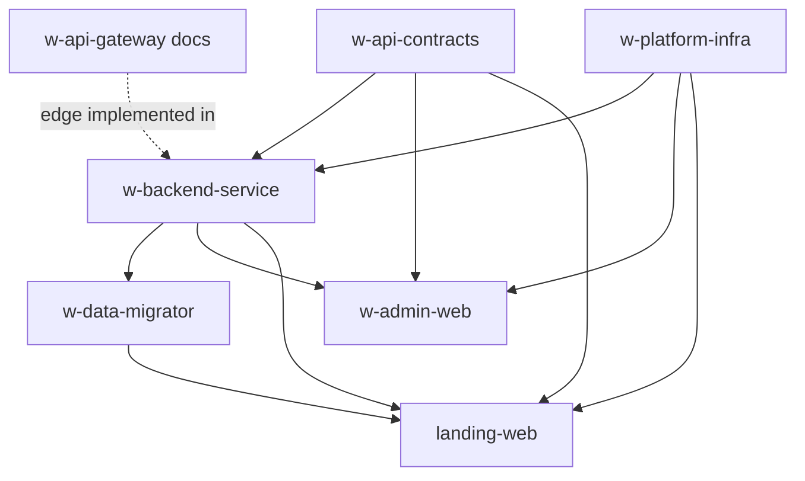

# Dependency Graph

```mermaid
flowchart TD
  contracts[w-api-contracts] --> backend[w-backend-service]
  infra[w-platform-infra] --> backend
  backend --> migrator[w-data-migrator]
  backend --> admin[w-admin-web]
  contracts --> admin
  backend --> landing[landing-web]
  contracts --> landing
  migrator --> landing
  gateway[w-api-gateway docs] -. edge implemented in .-> backend
  infra --> admin
  infra --> landing
```

Implementation order: contracts, infra, backend foundation/auth/storage/catalog/content/leads, migrator, admin, public frontend, testing, VPS.

