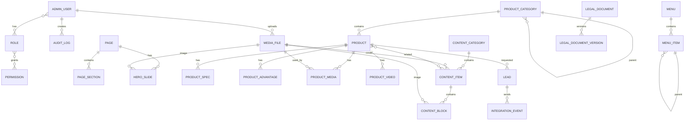

# План создания backend-системы и административной панели для landing-web

## Актуализация от 2026-07-15

Документ сохранен как предварительный аудит и дополнен новым переносимым SDD-пакетом в `architecture-sdd/`. При дальнейшей реализации приоритет имеют документы из `architecture-sdd/`, потому что в них зафиксированы утвержденные решения:

- backend: Java 21, Spring Boot 3.x, PostgreSQL, Flyway, Spring Security, OpenAPI, Docker Compose;
- архитектура backend: Spring Boot modular monolith;
- API Gateway в MVP: internal edge layer внутри `w-backend-service`, без отдельного deployable gateway;
- source of truth до миграции: текущий S3 для JSON и файлов; локальные `src/data` и `src/data_v2` только для сравнения;
- source of truth после миграции: PostgreSQL для структурированных данных, S3 для бинарных файлов;
- маршруты `/home` и `/news/:id` сохраняются;
- legacy-блоки `/home` сохраняются, помечаются deprecated и управляются в админке;
- публичные ID товаров, новостей, статей и слайдов сохраняются;
- многоязычность и scheduled publication не входят в MVP;
- роли админки: `ADMIN`, `FEATURE_OWNER`, `CONTENT_READER`;
- основной канал уведомлений в MVP: email через Spring Mail/SMTP;
- Telegram и Bitrix не входят в happy path MVP; Telegram только stub, Bitrix только future adapter;
- PDF и сертификаты хранятся в S3, в PostgreSQL хранятся metadata и связи.

Change log:

- прежнее предположение о выборе backend-стека заменено утвержденным Java/Spring Boot стеком;
- прежняя рекомендация по source of truth уточнена: актуальные исходные данные брать из S3, а не из локальных JSON;
- публичный endpoint детальной новости/статьи должен использовать существующий ID (`/api/v1/public/news/{id}`), не slug;
- роль `SUPER_ADMIN` заменена на утвержденную `ADMIN`, набор ролей сокращен до трех;
- публикация по расписанию исключена из MVP; используется `DRAFT`, `ACTIVE`, `ARCHIVED`;
- Telegram/Bitrix перенесены из целевых MVP-интеграций в adapter/stub future extension.

## 1. Назначение документа

Документ описывает технический план перевода frontend-проекта `landing-web` со статических JSON/S3-данных и захардкоженного JSX-контента на динамическую архитектуру с backend-приложением, базой данных, API, файловым хранилищем и административной панелью.

Цели:

- убрать ручное редактирование JSON и JSX для управляемого контента;
- хранить каталог оборудования, новости, статьи, слайды, контакты, SEO и заявки в базе данных;
- дать администраторам интерфейс для управления сайтом без изменения исходного кода;
- перенести публичные секреты и внешние интеграции с клиента на backend;
- сохранить текущую структуру сайта и подготовить основу для масштабирования.

Ограничение текущего этапа: backend, база данных и админ-панель не реализуются. Создается план, основанный на фактическом коде frontend-проекта.

## 2. Краткое описание текущего проекта

`landing-web` - SPA-сайт компании ФКИТ/kitexp.ru для промышленного оборудования. Основные разделы:

- каталог оборудования с категориями и карточками товаров;
- детальная страница оборудования с галереей, характеристиками, преимуществами, видео Rutube и связанными статьями;
- информационный раздел с новостями и полезными статьями;
- страница о компании;
- контакты и формы заявок;
- политика конфиденциальности;
- legacy-страница `/home` с более старым набором блоков.

Текущая архитектура:

- React/Ionic SPA через Vite;
- маршруты на `react-router-dom`;
- часть контента загружается из публичного Yandex Object Storage S3 как JSON;
- часть контента захардкожена в TSX-компонентах;
- формы заявок отправляются из браузера напрямую в Telegram Bot API или Bitrix24 webhook;
- статические meta/OG и Яндекс.Метрика прописаны в `index.html`, динамические meta обновляются компонентом `DocumentHead`.

## 3. Используемый frontend-стек

Факты из `landing-web/package.json`, `landing-web/vite.config.ts`, `landing-web/src/main.tsx`:

| Область | Используется |
| --- | --- |
| Framework | React `19.2.0` |
| UI/runtime | Ionic React `8.7.8`, Ionicons `8.0.13` |
| Router | `react-router-dom` `6.30.1` |
| Build | Vite `7.1.7` |
| Language | TypeScript `~5.9.3`, strict mode |
| Styling | CSS Modules + global CSS |
| Deployment | Docker + nginx, GitHub Actions, static `dist` |
| Optional prerender | `vite-plugin-prerender` через runtime `require`, зависимость не установлена |
| Tests | не обнаружены |

Важные замечания:

- `src/main.tsx` - фактическая точка входа React-приложения.
- `src/main.ts`, `src/counter.ts`, `src/typescript.svg`, `public/vite.svg` - остатки шаблона Vite, сейчас не участвуют в `index.html`.
- `vite.config.ts` пытается подключить prerender в production, но зависимость отсутствует в `package.json`; сборка должна работать без prerender.

## 4. Структура frontend-проекта

```text
landing-web/
├── src/
│   ├── App.tsx                         # маршруты приложения и глобальная модалка заявки
│   ├── main.tsx                        # React/Ionic entrypoint
│   ├── components/                     # UI и контентные блоки
│   ├── contexts/                       # состояние модалки заявки
│   ├── config/                         # Bitrix и SEO/site config
│   ├── data/                           # локальные JSON-данные, 1-я версия
│   ├── data_v2/                        # локальные JSON-данные, 2-я версия
│   ├── routes/                         # страницы
│   ├── types/                          # Product, News
│   ├── utils/                          # fetchStaticData, errorHandler
│   └── styles/                         # глобальные стили
├── public/                             # logo, favicon, robots, yandex verification
├── docs/                               # документация
├── templates/                          # markdown-шаблоны страниц
├── .github/workflows/deploy.yaml       # CI/CD
├── Dockerfile
├── nginx.conf
├── index.html
├── package.json
└── vite.config.ts
```

## 5. Карта страниц и маршрутов

| Страница | Маршрут | Файлы | Текущий источник данных | Требуемый backend | Управление в админке |
| --- | --- | --- | --- | --- | --- |
| Каталог оборудования | `/`, `/equipment` | `src/routes/EquipmentPage.tsx`, `EquipmentCarousel`, `EquipmentFilter`, `EquipmentLayout`, `EquipmentCard`, `CooperationFormSection`, `Footer` | `S3_URLS.PRODUCTS`, `S3_URLS.CAROUSEL`; захардкоженные маппинги категорий и тексты состояний | API категорий, подкатегорий, товаров, слайдов, SEO страницы, публичные настройки | Да: товары, категории, порядок, слайды, CTA, SEO |
| Карточка оборудования | `/equipment/:id` | `src/routes/ProductDetailPage.tsx`, `ProductHeader`, `ProductGallery`, `ProductDescription`, `ProductSpecs`, `ProductVideo`, `ProductRelatedArticles` | `S3_URLS.PRODUCTS`, `S3_URLS.ARTICLES`; Rutube URL в product JSON | API товара по slug/id, галереи, характеристик, преимуществ, видео, связанных материалов | Да: все поля товара, изображения, видео, связи со статьями, SEO |
| Информация | `/information`, `/information#articles`, `/information#news` | `src/routes/InformationPage.tsx`, `PageHero`, `NewsGrid`, `NewsCard`, `Footer` | `S3_URLS.NEWS`, `S3_URLS.ARTICLES`; фильтры и тексты UI в JSX | API материалов с типом `news/article`, поиском, фильтром по датам, пагинацией | Да: статьи, новости, категории, публикация, SEO |
| Детальная статья/новость | `/news/:id` | `src/routes/NewsArticlePage.tsx`, `ArticleHero`, `ArticleBody`, `ArticleShare`, `RelatedNews` | объединение `S3_URLS.NEWS` и `S3_URLS.ARTICLES` | API материала по slug/id, блоки контента, похожие материалы, SEO | Да: редактор блоков, изображения, внешние ссылки, публикация |
| Legacy список новостей | `/news` -> redirect на `/information#news`; файл `NewsPage.tsx` есть | `src/routes/NewsPage.tsx` | `S3_URLS.NEWS` | Либо удалить route после согласования, либо сохранить API списка новостей | Да, если маршрут будет возвращен |
| О компании | `/about` | `src/routes/AboutPage.tsx`, `CompanyIntro`, `Certificates`, `CooperationFormSection`, `Footer` | почти весь контент в JSX; `CompanyIntro` использует S3 image; секции сертификатов/клиентов отключены `{false && ...}` | API страницы с секциями, компетенциями, сертификатами, клиентами, CTA | Да: блоки страницы, изображения, сертификаты, клиенты, SEO |
| Контакты | `/contacts` | `src/routes/ContactsPage.tsx`, `ContactInfo`, `CooperationFormSection`, `Footer` | контакты, адрес, email, Rutube URL и лого в JSX | API контактных данных, соцсетей, формы заявки, SEO | Да: контакты, соцсети, форма, SEO |
| Политика конфиденциальности | `/privacy-policy` | `src/routes/PrivacyPolicyPage.tsx` | весь юридический текст в JSX | API юридической страницы или CMS page с версиями | Да: текст, дата вступления, версии, SEO; нужна история |
| Legacy главная | `/home` | `src/routes/HomePage.tsx`, `Hero`, `AboutSection`, `Features`, `ProductsPreview`, `Advantages`, `Certificates`, `NewsPreview`, `Footer` | часть S3, часть статические массивы | Если остается, API главной страницы и блоков | Да, если маршрут остается |
| 404 | `*` | `src/routes/NotFoundPage.tsx` | статический текст | API не обязателен; можно управлять SEO/текстом через настройки | Опционально |

## 6. Карта компонентов

| Компонент | Назначение | Данные | Замечания для backend |
| --- | --- | --- | --- |
| `Header` | шапка, desktop/mobile меню, поиск, CTA | статические разделы меню и anchors | заменить на API меню; категории оборудования не должны дублироваться с каталогом |
| `Footer` | подвал, быстрые ссылки, контакты, Rutube | статический JSX + внешнее SVG Rutube | вынести контакты, ссылки, соцсети, юридический текст в настройки сайта |
| `EquipmentCarousel` | hero-карусель каталога | `S3_URLS.CAROUSEL` | сущность `hero_slide`, порядок, статус, ссылка, изображение |
| `EquipmentFilter` | фильтр каталога | получает структуру из товаров | backend должен отдавать категории с counts или frontend строит из API |
| `EquipmentLayout`, `EquipmentCard` | сетка/карточка товара | Product props | публичный DTO товара |
| `SearchModal` | поиск оборудования | грузит все products из S3 и фильтрует в браузере | заменить на `/public/search/equipment?q=...` или `/public/products?search=...` |
| `ProductDescription` | описание и преимущества товара | Product fields + fallback advantages | fallback перенести в настройки или исключить после миграции |
| `ProductSpecs` | характеристики товара | `specs` object + static labels | нормализовать характеристики и labels в БД |
| `ProductVideo` | iframe Rutube | URL из товара | хранить video provider/id/url, валидировать домены |
| `ProductRelatedArticles` | связанные статьи | product.materialsAndNews.articles | relation product-material |
| `NewsGrid`, `NewsCard` | список материалов | News props | публичный endpoint с пагинацией |
| `ArticleBody` | блоки статьи | `paragraph/image/quote/link` | в БД нужны блоки с типом, позицией и payload |
| `ArticleShare` | share links | window.open Facebook/LinkedIn/Telegram | можно оставить frontend-only; список провайдеров опционально в настройках |
| `ContactInfo` | контакты | статические constants/JSX | сущности contacts/social_links |
| `CooperationForm` | основная форма заявки | React state, env, Telegram/Bitrix fetch | заменить на backend `/public/leads`; интеграции выполнять сервером |
| `ContactForm` | простая форма с alert | статическая, без реальной отправки | либо удалить, либо подключить к тому же API заявок |
| `ContactFormModal` | modal для заявки по товару | productName context | API заявки должен принимать productId/productName/source |
| `DocumentHead` | title, description, OG, canonical | props + `DEFAULT_META` | backend должен отдавать SEO-поля для страниц/материалов/товаров |
| `CompanyIntro` | блок о компании | статический текст + S3 image | CMS page sections |
| `Certificates` | список сертификатов | static array | сущность certificate, сейчас секция отключена на `/about`, но используется на `/home` |
| `Advantages`, `Features`, `Applications`, `FAQ`, `Gallery`, `Testimonials`, `ProductsSection` | legacy/home blocks | static arrays | включить в миграцию, если `/home` остается |

## 7. Инвентаризация статических данных

| Файл | Компонент/область | Тип данных | Текущее хранение | Будущая сущность | Управление через админку |
| --- | --- | --- | --- | --- | --- |
| `src/data_v2/products.json` | каталог | 37 товаров, категории, характеристики, преимущества, изображения, Rutube | локальный JSON, аналог в S3 | `product`, `product_category`, `product_media`, `product_spec`, `product_advantage` | Да, основной источник миграции-кандидат |
| `src/data/products.json` | каталог | 19 товаров, старая версия | локальный JSON | те же сущности | Да, сверить с `data_v2` перед импортом |
| `src/data_v2/news.json` | новости | 1 новость | локальный JSON, аналог в S3 | `content_item` type `NEWS`, `content_block` | Да |
| `src/data/news.json` | новости | 9 новостей | локальный JSON | `content_item`, `content_block`, `content_category` | Да, вероятно основной seed |
| `src/data_v2/articles.json` | статьи | 1 статья | локальный JSON | `content_item` type `ARTICLE` | Да |
| `src/data/articles.json` | статьи | 5 статей, есть внешние `example.com` ссылки | локальный JSON | `content_item`, `content_block` | Да, проверить внешние ссылки |
| `src/data_v2/carousel.json`, `src/data/carousel.json` | карусель | 3 слайда | локальный JSON, аналог в S3 | `hero_slide` | Да |
| `src/utils/fetchStaticData.ts` | S3 URL | host/bucket/path constants, cache TTL | TS constants/env | `site_setting` + backend config | Админка только для публичных настроек; секреты нет |
| `src/routes/EquipmentPage.tsx` | каталог | category-to-global mapping, порядок категорий, порядок подкатегорий | TS constants | `product_category.parent_id`, `sort_order` | Да |
| `src/components/Header/Header.tsx` | меню | пункты меню, anchors, CTA text | TS arrays/JSX | `menu`, `menu_item`, `site_setting` | Да |
| `src/components/Footer/Footer.tsx` | footer | описание компании, links, адрес, телефоны, email, Rutube | JSX | `site_setting`, `contact`, `social_link`, `menu_item` | Да |
| `src/components/ContactInfo/ContactInfo.tsx` | контакты | адрес, телефон, emails, Rutube URL/logo | constants/JSX | `contact`, `social_link` | Да |
| `src/routes/AboutPage.tsx` | о компании | миссия, компетенции, отключенные сертификаты/клиенты | JSX | `page`, `page_section`, `competence`, `client`, `certificate` | Да; история нужна |
| `src/components/CompanyIntro/CompanyIntro.tsx` | о компании | текст, направления, badges, chips, image | JSX/S3 path | `page_section`, `media_file`, `badge` | Да |
| `src/components/Certificates/Certificates.tsx` | сертификаты | 6 сертификатов | TS array | `certificate` | Да; файлы сертификатов опционально |
| `src/routes/PrivacyPolicyPage.tsx` | политика | юридический текст, дата 07.03.2026, contacts | JSX | `legal_document`, `legal_document_version` | Да; история обязательна |
| `src/components/CooperationForm/CooperationForm.tsx` | заявки | поля формы, success/error texts, Telegram/Bitrix payload | JSX/env/fetch | `lead`, `integration_event`, `form_setting` | Да: просмотр заявок и статусов, тексты формы опционально |
| `src/config/bitrix.ts` | Bitrix | webhook URL, demo/disabled flags | env + fallback URL | backend integration config/secret | Только через защищенные настройки, секреты маскировать |
| `index.html` | SEO/аналитика | favicon/OG defaults, Yandex.Metrika id `106841950` | HTML | `seo_setting`, `analytics_setting` | Да для ID/включения, либо env |
| `public/logo.svg`, favicon | бренд | logo/favicon | public files | `media_file` или build asset | Да для logo/favicon при необходимости |
| `public/robots.txt` | SEO | sitemap `https://kitexp.ru/sitemap.xml` | public file | backend/static generator | Админка опционально |
| `src/components/Advantages/Advantages.tsx` | legacy block | 4 преимущества | TS array | `page_section_item` | Да, если `/home` остается |
| `src/components/Features/Features.tsx` | legacy block | 4 ценности | TS array | `page_section_item` | Да |
| `src/components/Applications/Applications.tsx` | legacy block | 3 применения | TS array | `page_section_item` | Да |
| `src/components/FAQ/FAQ.tsx` | legacy block | 6 FAQ | TS array | `faq_item` | Да |
| `src/components/Gallery/Gallery.tsx` | legacy block | 9 gallery items | TS array + S3 paths | `gallery_item`, `media_file` | Да |
| `src/components/Testimonials/Testimonials.tsx` | legacy block | 3 отзыва | TS array | `testimonial` | Да |
| `src/components/ProductsSection/ProductsSection.tsx` | legacy products | 4 static products | TS array | сверить с `product`; скорее удалить дубли | Да, если остается |
| `templates/*.md` | шаблоны страниц | описания/контент страниц | markdown files | источник для CMS-страниц | Использовать как справочный материал |

## 8. Текущие внешние запросы и интеграции

| Файл/функция | Ресурс | Метод | Параметры/тело | Ошибки | Авторизация | Что делать |
| --- | --- | --- | --- | --- | --- | --- |
| `src/utils/fetchStaticData.ts` | `https://storage.yandexcloud.net/{bucket}/data/...json` | GET | JSON-файлы products/news/articles/carousel | throw Error, console logs, in-memory cache 5 минут | нет | заменить на backend public API; S3 оставить для медиа |
| `src/components/CooperationForm/CooperationForm.tsx` | `https://api.telegram.org/bot{token}/sendMessage` | POST | `chat_id`, `text`; token из `VITE_TELEGRAM_BOT_TOKEN` | текст ошибки Telegram/API/timeout | token публично попадает в frontend build | перенести на backend; token хранить как secret |
| `src/components/CooperationForm/CooperationForm.tsx` | Bitrix24 inbound webhook | POST | `crm.lead.add.json` fields | детальная обработка Bitrix/network/CORS | webhook публичен в frontend build | перенести на backend; хранить webhook secret |
| `index.html` | Yandex.Metrika `mc.yandex.ru` | script/img | counter id `106841950` | нет | нет | оставить, но вынести ID/включение в config |
| `Footer`, `ContactInfo` | Rutube channel | link/image | external link, logo с Wikimedia | нет | нет | хранить соцссылки в БД; логотип лучше локально/в медиа |
| `ProductVideo` | Rutube embed | iframe | Rutube video id из URL | нет | нет | хранить provider/video_id; валидировать allowlist |
| `ArticleShare` | Facebook, LinkedIn, Telegram share | `window.open` | URL/title | нет | нет | можно оставить frontend-only |
| `src/data/articles.json` | `https://example.com/...` | external link in content | link blocks | нет | нет | заменить реальными URL или удалить при миграции |

Риск текущей архитектуры: Telegram bot token и Bitrix webhook при production build могут быть доступны пользователям сайта, если заданы как `VITE_*` переменные. Это нужно исправить одним из первых backend-этапов.

## 9. Проблемы текущей архитектуры

- Контент частично в S3 JSON, частично в JSX, частично в public/assets, что усложняет поддержку.
- Нет единой модели категорий: `Header` и `EquipmentPage` содержат разные статические списки/порядки, а товары имеют свои `globalCategory/category`.
- Нет админки, валидации контента, истории изменений, черновиков и публикации по расписанию.
- Нет серверного поиска, пагинации и нормальной фильтрации; списки загружаются целиком.
- Нет backend-валидации форм и защиты от спама.
- Секреты интеграций потенциально попадают в клиентский JavaScript.
- SEO для SPA зависит от клиентского `DocumentHead`; без полноценного SSR/SSG боты могут видеть базовый HTML.
- Нет тестов.
- Есть legacy/мертвые файлы (`src/main.ts`, Vite assets), устаревшие маршруты и отключенные секции.
- Нет централизованного аудита, логирования действий администраторов и заявок.

## 10. Целевая архитектура

Предположение по backend-стеку: если заказчик не уточнит стек, рекомендуется Java 21 + Spring Boot 3.x + PostgreSQL 16 + Flyway + Spring Security. Если нужен быстрый единый TypeScript-стек, альтернативой может быть NestJS + PostgreSQL, но далее план описан в терминах Spring Boot.

```text
Пользователь
  -> public frontend landing-web
  -> /api/v1/public/* backend

Администратор
  -> admin frontend
  -> /api/v1/admin/* backend

Backend
  -> PostgreSQL: контент, пользователи, роли, заявки, аудит
  -> Object Storage/S3: изображения, документы
  -> Telegram/Bitrix24: серверные интеграции заявок
  -> SMTP/уведомления: опционально
```

Рекомендуемое разделение доменов:

```text
kitexp.ru или www.kitexp.ru      - публичный frontend
api.kitexp.ru                    - backend API
admin.kitexp.ru                  - административная панель
storage/CDN                      - публичные медиа с подписанными admin-upload URL
```

Для dev/staging:

```text
stanley.derendyaev.ru            - текущий dev frontend по CI
api-dev.<domain>                 - dev backend
admin-dev.<domain>               - dev admin
```

## 11. Основные бизнес-сущности

### Администрирование

- `AdminUser`: email, passwordHash, fullName, status, lastLoginAt, failedAttempts, lockedUntil, twoFactorEnabled.
- `Role`: code, name, description.
- `Permission`: code, module, action.
- `AdminSession` или refresh token: user, token hash, expiresAt, revokedAt, ip, userAgent.
- `AuditLog`: actor, action, entityType, entityId, oldValue, newValue, ip, userAgent.

### Контент сайта

- `Page`: route, slug, title, type, status, SEO, publish windows.
- `PageSection`: page, code, title, subtitle, body, media, sortOrder, status.
- `Menu` и `MenuItem`: header/footer меню, parent-child, route/url/anchor, sortOrder, visible.
- `SiteSetting`: logo, contacts summary, analytics id, default SEO, form settings.

### Каталог оборудования

- `ProductCategory`: parent category, name, slug, sortOrder, description, seo, status.
- `Product`: slug/id, name, shortDescription, fullDescription, category, status, sortOrder, featured, SEO, publishedAt.
- `ProductSpec`: product, key, label, value, unit, sortOrder.
- `ProductAdvantage`: product, icon, title, description, sortOrder.
- `ProductMedia`: product, mediaFile, role `MAIN/GALLERY`, alt, sortOrder.
- `ProductVideo`: product, provider `RUTUBE`, sourceUrl, embedUrl/videoId, sortOrder.
- `ProductRelatedContent`: product, contentItem, sortOrder.

### Новости и статьи

- `ContentItem`: type `NEWS/ARTICLE`, slug, title, preview, category, coverMedia, status, publishedAt, SEO.
- `ContentCategory`: type, name, slug, sortOrder.
- `ContentBlock`: contentItem, blockType `PARAGRAPH/IMAGE/QUOTE/LINK`, payload, sortOrder.

### Слайды, медиа, контакты

- `HeroSlide`: pageCode, title, description, buttonText, linkType, linkUrl, mediaFile, sortOrder, status.
- `MediaFile`: storageKey, originalName, publicUrl, mimeType, size, checksum, width, height, alt, title, usageCount, uploadedBy.
- `Contact`: type `ADDRESS/PHONE/EMAIL`, label, value, href, sortOrder, visible.
- `SocialLink`: provider, url, icon/media, sortOrder, visible.

### Заявки и интеграции

- `Lead`: source, company, firstName, secondName, lastName, phone, email, comment, product, consentAccepted, status, ip, userAgent.
- `IntegrationConfig`: provider `TELEGRAM/BITRIX24`, enabled, encrypted credentials, target settings.
- `IntegrationEvent`: lead, provider, requestId/externalId, status, responseCode, errorMessage, retryCount.

### Юридические документы

- `LegalDocument`: code, title, slug, currentVersion.
- `LegalDocumentVersion`: document, body, effectiveDate, status, createdBy.

## 12. Предварительная модель базы данных



Ключевые таблицы:

| Таблица | Колонки | Индексы/ограничения | Удаление |
| --- | --- | --- | --- |
| `admin_users` | `id uuid`, `email`, `password_hash`, `full_name`, `status`, `last_login_at`, `failed_attempts`, `locked_until`, timestamps | unique `email`, index `status` | soft |
| `roles`, `permissions`, join tables | `code`, `name`, `description` | unique `code` | physical only if unused |
| `audit_logs` | actor, action, entity_type, entity_id, old_value jsonb, new_value jsonb, ip, created_at | index actor/date/entity | append-only |
| `pages` | route, slug, title, type, status, seo fields, published_at, archived_at | unique route/slug, status index | soft |
| `page_sections` | page_id, code, title, subtitle, body jsonb/text, media_id, sort_order, status | unique page+code | soft |
| `product_categories` | parent_id, name, slug, description, sort_order, status, seo | unique slug, index parent/status | soft, forbid if products exist |
| `products` | category_id, slug, external_id, name, short_description, full_description, status, sort_order, featured, seo, published_at | unique slug/external_id, indexes category/status/search | soft |
| `product_specs` | product_id, key, label, value, unit, sort_order | product+key | cascade soft/physical with product |
| `product_advantages` | product_id, icon, title, description, sort_order | product+sort | cascade |
| `product_media` | product_id, media_file_id, role, alt, sort_order | product+role+sort | cascade relation only |
| `product_videos` | product_id, provider, source_url, video_id, embed_url, sort_order | product index | soft |
| `content_categories` | type, name, slug, sort_order, status | unique type+slug | soft |
| `content_items` | type, category_id, slug, title, preview, cover_media_id, status, published_at, seo | unique type+slug, full-text title/preview | soft |
| `content_blocks` | content_item_id, block_type, payload jsonb, sort_order | item+sort | cascade with item |
| `hero_slides` | page_code, title, description, button_text, link_url, media_file_id, sort_order, status | page/status/sort | soft |
| `media_files` | storage_key, original_name, public_url, mime_type, size_bytes, checksum, width, height, alt, created_by | unique storage_key/checksum optional | soft; physical only if unused |
| `contacts` | type, label, value, href, sort_order, visible | type/sort | soft |
| `social_links` | provider, url, icon_media_id, sort_order, visible | provider | soft |
| `leads` | source, company, names, phone, email, comment, product_id, consent_accepted, status, ip, user_agent | status/date/product | soft/archive |
| `integration_events` | lead_id, provider, status, external_id, response_code, error_message, retry_count | lead/provider/status | append/archive |
| `legal_documents` | code, slug, title, current_version_id | unique code/slug | soft |
| `legal_document_versions` | document_id, body, effective_date, status, created_by | document/status/date | append-only |

Все основные таблицы должны иметь `created_at`, `updated_at`, `created_by`, `updated_by`, `deleted_at` там, где применимо.

## 13. Backend-модули

| Модуль | Назначение | Состав |
| --- | --- | --- |
| Auth | вход, refresh, logout, восстановление пароля | controllers `/auth`, JWT/session service, password hashing, rate limit |
| Admin users/RBAC | пользователи, роли, права | CRUD, role assignment, permission checks |
| Catalog | категории, товары, характеристики, преимущества, видео, связи | public/admin controllers, services, repositories, mappers, validators |
| Content | новости, статьи, блоки, категории | editor service, publication workflow, preview |
| Pages/Menu/Settings | страницы, секции, меню, контакты, соцсети, SEO, аналитика | generic CMS sections, menu builder |
| Media | загрузка, хранение, оптимизация, использование файлов | S3 client, MIME validation, image resize, orphan checks |
| Leads | прием заявок, статусы, комментарии | anti-spam validation, admin list, export |
| Integrations | Telegram, Bitrix24 | secret storage, retries, event log, health check |
| SEO | sitemap, robots, meta defaults | sitemap generation, canonical, OG |
| Audit | журнал действий | aspect/interceptor, diff serializer |
| Notifications | уведомления о заявках/ошибках | async jobs, retry |
| Observability | логирование, метрики, health | structured logs, actuator, tracing |

## 14. Публичное API

Базовый префикс: `/api/v1/public`.

| Метод | URL | Назначение | Доступ | Запрос | Ответ |
| --- | --- | --- | --- | --- | --- |
| GET | `/site` | базовые настройки сайта: logo, contacts, analytics, default SEO | public | - | `SitePublicDto` |
| GET | `/menu/{code}` | header/footer menu | public | `code=header/footer` | дерево пунктов |
| GET | `/pages/{route}` | данные CMS-страницы | public | route encoded | page sections + SEO |
| GET | `/products` | список товаров | public | `category`, `search`, `page`, `size`, `sort` | paged products |
| GET | `/products/categories` | дерево категорий с counts | public | optional `includeEmpty` | categories tree |
| GET | `/products/{slug}` | детальная карточка товара | public | slug | product detail |
| GET | `/products/{slug}/related-content` | связанные статьи | public | `limit` | content preview list |
| GET | `/content` | новости/статьи | public | `type`, `category`, `search`, `dateFrom`, `dateTo`, `page`, `size`, `sort` | paged content |
| GET | `/content/{type}/{slug}` | материал | public | type, slug | item + blocks + related |
| GET | `/slides` | слайды страницы | public | `pageCode` | active slides |
| GET | `/contacts` | контакты и соцсети | public | - | contacts/social links |
| GET | `/legal/{slug}` | политика/документы | public | slug | active version |
| POST | `/leads` | отправка заявки | public + rate limit | lead form body | lead id/status |
| GET | `/search` | общий поиск | public | `q`, `types`, `limit` | grouped results |
| GET | `/sitemap.xml` | sitemap | public | - | XML |

Пример `POST /api/v1/public/leads`:

```json
{
  "source": "PRODUCT_MODAL",
  "company": "ИП Титов",
  "firstName": "Глеб",
  "secondName": "Егорович",
  "lastName": "Титов",
  "phone": "+7 999 555-88-88",
  "email": "name@example.com",
  "comment": "Хочу запросить КП",
  "productSlug": "prestore-reactor-vm-1",
  "consentAccepted": true
}
```

Коды: `201`, `400`, `403` для отсутствия consent, `429`, `500`.

## 15. API административной панели

Базовый префикс: `/api/v1/admin`.

| Метод | URL | Назначение | Права |
| --- | --- | --- | --- |
| GET/POST | `/products` | список/создание товара | `PRODUCT_READ/PRODUCT_WRITE` |
| GET/PUT/DELETE | `/products/{id}` | просмотр/редактирование/архив | `PRODUCT_READ/PRODUCT_WRITE/PRODUCT_DELETE` |
| POST | `/products/{id}/publish` | публикация | `PRODUCT_PUBLISH` |
| POST | `/products/{id}/preview` | получить preview token/data | `PRODUCT_READ` |
| GET/POST/PUT/DELETE | `/product-categories` | категории | `CATALOG_WRITE` |
| GET/POST/PUT/DELETE | `/content-items` | новости/статьи | `CONTENT_*` |
| POST | `/content-items/{id}/publish` | публикация | `CONTENT_PUBLISH` |
| GET/POST/PUT/DELETE | `/content-categories` | категории материалов | `CONTENT_WRITE` |
| GET/POST/PUT/DELETE | `/slides` | слайды | `PAGE_WRITE` |
| GET/POST/PUT/DELETE | `/pages`, `/pages/{id}/sections` | страницы и секции | `PAGE_WRITE` |
| GET/POST/PUT/DELETE | `/menus`, `/menus/{id}/items` | меню | `SETTINGS_WRITE` |
| GET/PUT | `/settings/site`, `/settings/analytics`, `/settings/forms` | настройки | `SETTINGS_WRITE` |
| GET/POST/DELETE | `/media` | медиа-библиотека | `MEDIA_READ/MEDIA_WRITE/MEDIA_DELETE` |
| POST | `/media/upload` | загрузка файла | `MEDIA_WRITE` |
| GET | `/media/{id}/usage` | где используется файл | `MEDIA_READ` |
| GET/PUT | `/leads`, `/leads/{id}` | заявки и статусы | `LEAD_READ/LEAD_WRITE` |
| POST | `/leads/{id}/resend-integration` | повторная отправка | `INTEGRATION_WRITE` |
| GET/PUT | `/integrations/{provider}` | настройки интеграции | `INTEGRATION_ADMIN` |
| GET | `/audit-logs` | журнал действий | `AUDIT_READ` |
| GET/POST/PUT/DELETE | `/admin-users`, `/roles` | администраторы и роли | `USER_ADMIN` |

Все list endpoints должны поддерживать `page`, `size`, `sort`, фильтры, поиск. Все write endpoints возвращают DTO после сохранения и пишут `audit_logs`.

## 16. Структура административной панели

### Dashboard

Показатели, актуальные для проекта:

- количество опубликованных/черновых товаров;
- количество опубликованных/черновых статей и новостей;
- новые заявки за 24 часа/7 дней;
- последние измененные материалы;
- ошибки отправки заявок в Telegram/Bitrix24;
- неиспользуемые медиафайлы;
- быстрые действия: создать товар, создать статью, загрузить медиа, открыть заявки.

### Каталог оборудования

Разделы:

- категории: дерево, ручной порядок, slug, SEO, статус;
- товары: таблица с поиском, фильтром по категории/статусу, сортировкой, пагинацией;
- карточка товара: основные поля, категория, краткое/полное описание, характеристики, преимущества, галерея, видео, связанные статьи, SEO, публикация.

Правила:

- slug уникален;
- товар нельзя опубликовать без названия, категории, краткого описания и главного изображения;
- удаление категории запрещено, если есть активные товары;
- поддержать черновик, предпросмотр, архив, ручной порядок.

### Новости и статьи

- единый раздел `Материалы` с типом `Новость`/`Статья`;
- категории материалов;
- визуальный блочный редактор: paragraph, image, quote, link;
- cover image, preview, дата публикации, статус;
- фильтры по типу, категории, статусу, дате;
- предпросмотр и публикация по расписанию.

### Страницы и секции

- страницы: `/about`, `/contacts`, `/privacy-policy`, `/home` если сохранен;
- секции: заголовок, подзаголовок, rich text/json blocks, изображение, порядок, видимость;
- отдельные справочники для компетенций, сертификатов, клиентов, FAQ, отзывов только если они реально будут отображаться.

### Слайды

- список слайдов для каталога/главной;
- изображение, заголовок, описание, кнопка, ссылка, порядок, статус;
- validation ссылок: internal route, anchor, external URL, open form action.

### Контакты и настройки

- адреса, телефоны, emails;
- быстрые ссылки footer;
- соцсети;
- logo/favicon;
- analytics id и включение Яндекс.Метрики;
- default SEO.

### Заявки

- таблица заявок: дата, источник, товар, компания, ФИО, телефон, email, статус, интеграции;
- карточка заявки: комментарий, история статусов, события Telegram/Bitrix;
- фильтры: статус, период, товар, источник;
- действия: изменить статус, повторить отправку в интеграцию, экспорт CSV.

### Медиафайлы

- загрузка изображений и документов;
- ограничения типов: `image/jpeg`, `image/png`, `image/webp`, `image/svg+xml` осторожно, `application/pdf`;
- ограничение размера: например images до 10 MB, PDF до 25 MB;
- проверка MIME по содержимому, генерация уникального storage key;
- alt/title, поиск, фильтр по типу, список использования;
- запрет удаления используемого файла;
- генерация thumbnails/WebP для изображений.

### Администраторы, роли, аудит

- пользователи, роли, разрешения;
- блокировка пользователя;
- смена/восстановление пароля;
- журнал авторизаций;
- журнал действий с diff old/new;
- 2FA опционально, но рекомендуется для production.

## 17. Роли и разрешения

Минимальные роли:

| Роль | Права |
| --- | --- |
| `SUPER_ADMIN` | все права, управление пользователями и интеграциями |
| `CONTENT_MANAGER` | товары, статьи, новости, страницы, медиа без управления пользователями |
| `SALES_MANAGER` | просмотр/обработка заявок, просмотр товаров |
| `VIEWER` | чтение контента и заявок без изменений |

Разрешения должны быть атомарными: `PRODUCT_READ`, `PRODUCT_WRITE`, `PRODUCT_PUBLISH`, `CONTENT_WRITE`, `MEDIA_DELETE`, `LEAD_WRITE`, `SETTINGS_WRITE`, `USER_ADMIN`, `AUDIT_READ`, `INTEGRATION_ADMIN`.

## 18. Управление файлами

Рекомендуемый подход:

- хранить файлы в S3-compatible object storage, метаданные в `media_files`;
- загрузка только через backend/admin API;
- публичная выдача через CDN/public URL для опубликованных файлов;
- для приватных документов - signed URLs;
- уникальные имена: `{entity}/{yyyy}/{uuid}-{safe-name.ext}`;
- проверять MIME и расширение, размер, checksum;
- для изображений извлекать width/height, генерировать thumbnail и optimized WebP;
- поддерживать `alt` для SEO/accessibility;
- считать usageCount или определять usage через relation tables.

## 19. Изменения во frontend

План изменений без текущей реализации:

| Область | Что заменить | Новый API | UI состояния |
| --- | --- | --- | --- |
| `fetchStaticData.ts` | S3 JSON loader | `src/api/client.ts` + typed clients | общий error handler, retry для idempotent GET |
| `EquipmentPage` | загрузку all products из S3, static category order | `/public/products`, `/public/products/categories`, `/public/slides?pageCode=equipment` | skeleton каталога, empty categories |
| `Header` | static меню/категории | `/public/menu/header` или `/public/products/categories` | fallback меню при ошибке |
| `SearchModal` | client-side поиск по всем products | `/public/products?search=q&size=10` или `/public/search` | debounce, loading, empty, error |
| `ProductDetailPage` | поиск товара в загруженном массиве | `/public/products/{slug}` | 404 от API, skeleton, related endpoint |
| `InformationPage` | загрузку всех news/articles | `/public/content?type=...` | server pagination/search/date filters |
| `NewsArticlePage` | объединение news/articles arrays | `/public/content/{type}/{slug}` или unified `/public/content/{slug}` | 404, related |
| `AboutPage`, `ContactsPage`, `PrivacyPolicyPage` | JSX-тексты | `/public/pages/{route}`, `/public/contacts`, `/public/legal/privacy-policy` | graceful fallback/empty |
| `CooperationForm` | прямой Telegram/Bitrix fetch | `POST /public/leads` | validation errors, success id, rate-limit text |
| `DocumentHead` | props-only SEO | SEO из API DTO | сохранить client update или перейти к SSR/SSG |

Frontend config:

- `VITE_API_BASE_URL`;
- `VITE_SITE_URL`;
- удалить `VITE_TELEGRAM_BOT_TOKEN`, `VITE_BITRIX_WEBHOOK_URL` из frontend;
- CORS разрешить только публичный домен и admin домен;
- admin token хранить в httpOnly cookie или memory + refresh flow, не в localStorage при возможности;
- TypeScript-типы генерировать из OpenAPI или поддерживать `src/api/types.ts`.

## 20. Миграция существующих данных

| Текущий источник | Тип данных | Целевая таблица | Способ переноса | Проверка |
| --- | --- | --- | --- | --- |
| `src/data_v2/products.json` | товары | `products`, related tables | seed/import script JSON -> DTO -> DB | count 37, slug/id unique, категории совпадают |
| `src/data/products.json` | товары старая версия | staging temp | сравнить с v2, импортировать недостающие вручную | diff по id |
| `src/data/news.json` | новости | `content_items`, `content_blocks` | автоматический импорт | count 9, images exist |
| `src/data_v2/news.json` | новая/альтернативная новость | `content_items` | merge после dedupe по id | no duplicates |
| `src/data/articles.json` | статьи | `content_items`, `content_blocks` | автоматический импорт, проверить `example.com` | count 5, links validated |
| `src/data_v2/articles.json` | новая/альтернативная статья | `content_items` | merge после dedupe | no duplicates |
| `src/data*/carousel.json` | слайды | `hero_slides` | import latest | 3 active slides |
| JSX contacts/footer/header | настройки/меню/контакты | `contacts`, `social_links`, `menu_items`, `site_settings` | ручной seed на основе компонентов | визуальное сравнение страниц |
| JSX about/privacy/home blocks | страницы/секции/legal | `pages`, `page_sections`, `legal_document_versions` | ручной seed или markdown transform | тексты совпадают |
| S3 image paths | медиа | `media_files` | scan JSON paths, HEAD/checksum optional | все URL доступны |

Повторяемая миграция:

- importer должен быть идемпотентным по `external_id`/slug;
- перед импортом делать backup DB;
- импортировать в staging, сверить counts и screenshots;
- rollback: Flyway rollback недоступен в community, поэтому нужен DB backup restore или reverse migration для seed data.

## 21. Безопасность

- Пароли: Argon2id или BCrypt с актуальным cost.
- Auth: access token 10-15 минут + refresh token 7-30 дней с хранением hash и revoke; для admin предпочтительны httpOnly Secure SameSite cookies.
- CSRF: обязателен при cookie-auth для admin write operations.
- CORS: allowlist доменов, без `*` для credentials.
- XSS: санитизация rich text/content blocks, CSP, запрет произвольных script/iframe кроме allowlist Rutube.
- SQL injection: ORM/prepared statements, no string SQL concat.
- Rate limiting: `/auth/login`, `/public/leads`, `/media/upload`.
- Brute-force: failed attempts, lockout, captcha/2FA при необходимости.
- Файлы: MIME sniffing, AV scan опционально, max size, запрет исполняемых файлов, SVG только после sanitize или запрет.
- Секреты: Telegram/Bitrix в backend secret storage/env, не возвращать в API.
- Ошибки: не раскрывать stack traces клиенту.
- Аудит: все admin write/delete/publish/login/logout.
- PII: заявки содержат персональные данные; маскировать в логах, ограничить доступ, определить retention.
- HTTPS: обязательно для site/admin/api.
- Backups: ежедневный DB backup, регулярная проверка восстановления.

## 22. Обработка ошибок

Единый формат:

```json
{
  "timestamp": "2026-07-15T00:00:00Z",
  "status": 400,
  "code": "VALIDATION_ERROR",
  "message": "Некорректные данные",
  "fields": {
    "email": "Некорректный email"
  },
  "requestId": "..."
}
```

Для frontend:

- `400` - показать ошибки полей;
- `401/403` - redirect/login или forbidden state;
- `404` - not found page;
- `409` - конфликт slug/version;
- `413/415` - ошибка файла;
- `429` - сообщение о слишком частых запросах;
- `5xx` - generic message + requestId.

## 23. Логирование и аудит

- Backend logs: JSON, requestId, userId, method, path, status, latency.
- Не логировать пароли, токены, webhook URL, полные телефоны/email без необходимости.
- Audit logs: entity type/id, action, actor, old/new JSON diff, IP, userAgent.
- Integration logs: provider, leadId, externalId, request status, error message.
- Admin UI: фильтры по actor, entity, action, date.

## 24. Тестирование

Backend:

- unit: services, validators, mappers, slug generation, Rutube URL parser;
- repository: categories tree, content search, soft delete filters;
- controller/API: public products/content/leads, admin CRUD;
- security: role access matrix, login lockout, CSRF/CORS;
- integration: PostgreSQL Testcontainers, S3 mock/localstack, Telegram/Bitrix mock;
- migrations: Flyway clean/migrate in CI;
- file upload: MIME/size/duplicate/used-file-delete;
- migration tests: import JSON counts and required fields.

Frontend after integration:

- API client tests;
- components loading/error/empty states;
- E2E: browse catalog, product page, search, information filters, submit lead, admin login/content publish.

Smoke production:

- `/equipment`, `/equipment/{slug}`, `/information`, `/news/{slug}`, `/contacts`;
- lead submission creates DB row and integration event;
- admin can publish content and public API reflects it.

## 25. Инфраструктура и развертывание

Рекомендуемые компоненты:

- frontend: static nginx/CDN;
- admin frontend: static nginx/CDN, separate host;
- backend: Docker image, Spring Boot app;
- DB: PostgreSQL with backups;
- object storage: Yandex Object Storage/S3;
- reverse proxy: nginx/Traefik with TLS;
- CI/CD: build/test backend, build frontend/admin, run migrations, deploy staging, manual approval production;
- monitoring: uptime checks, API health, DB metrics, integration error alerts;
- centralized logs: Loki/ELK or cloud provider equivalent.

Среды:

- local: Docker Compose `postgres`, `backend`, optional `minio`, frontend dev server;
- staging: mirrors production with test integrations;
- production: separate secrets, backups, monitoring, restricted admin access.

## 26. Этапы разработки

| Этап | Цель | Задачи | Зависимости | Результат | Критерии приемки | Риски | Сложность |
| --- | --- | --- | --- | --- | --- | --- | --- |
| 1. Аудит и фиксация требований | подтвердить модель | сверить `data` vs `data_v2`, MVP, роли, список управляемых секций, стек | этот документ | согласованное ТЗ | утверждены сущности и MVP | неясно, какие legacy-блоки нужны | средняя |
| 2. Проектирование | зафиксировать архитектуру | ERD, OpenAPI, security model, storage, admin wireframes | этап 1 | спецификации | OpenAPI/DB schema reviewed | переусложнение CMS | средняя |
| 3. Основа backend | поднять сервис | Spring Boot, config, Flyway, error handler, logging, Docker, OpenAPI | этап 2 | runnable backend | health, migrations, swagger работают | инфраструктурные задержки | средняя |
| 4. Авторизация и администрирование | защитить admin API | users, roles, permissions, sessions, password reset, audit login | этап 3 | secure admin foundation | role matrix tests pass | ошибки RBAC | высокая |
| 5. Контентные модули | реализовать бизнес API | каталог, материалы, страницы, меню, контакты, слайды, legal, leads, integrations | этап 4 частично | public/admin APIs | CRUD + public reads + tests | миграция JSON сложнее ожидаемой | высокая |
| 6. Административная панель | дать UI управления | dashboard, tables, forms, media picker, publication flow, audit | admin API | admin frontend | content manager создает/публикует контент | UX редактора блоков | высокая |
| 7. Интеграция frontend с API | убрать S3 JSON | API client, types, loading/error, replace static data, remove secrets | public API stable | сайт работает от backend | страницы визуально совпадают, forms via backend | SEO/SSG нюансы | высокая |
| 8. Миграция данных | перенести текущий контент | import products/news/articles/slides/media/static pages | modules ready | DB seeded | counts match, links/images checked | дубли `data`/`data_v2` | средняя |
| 9. Тестирование | снизить риск релиза | backend/frontend/API/security/E2E/load/smoke | этапы 3-8 | test report | critical paths pass | нет исходных тестов | высокая |
| 10. Развертывание | выпустить staging/prod | CI/CD, migrations, backups, monitoring, docs, rollback plan | этап 9 | production release | smoke ok, monitoring ok, rollback tested | DNS/TLS/secrets | средняя |

## 27. Риски

- Не определено, какой JSON-набор является актуальным: `data` или `data_v2`.
- Текущий frontend хранит интеграционные секреты как `VITE_*`; это срочный security debt.
- Часть контента отключена в JSX, но может быть нужна бизнесу позже.
- SEO SPA может быть недостаточным для поисковиков без SSR/SSG/prerender.
- Нужна нормализация характеристик товаров: сейчас `specs` - свободный объект.
- В `ProductMaterialsAndNews` есть опечатка `atricles`; миграция должна учитывать оба поля.
- Rutube/Wikimedia/external links могут быть недоступны или измениться.
- Нет тестовой базы и тестов, поэтому интеграция frontend с API потребует ручного визуального контроля.

## 28. Открытые вопросы

1. Какой backend-стек утвержден: Java 21/Spring Boot/PostgreSQL или другой?
2. Какой набор данных считать актуальным: `src/data`, `src/data_v2` или текущие файлы в S3?
3. Нужно ли сохранять маршрут `/home` и legacy-блоки?
4. Должны ли `/news/:id` остаться для статей и новостей, или нужны SEO-friendly маршруты `/articles/:slug` и `/news/:slug`?
5. Нужна ли многоязычность сейчас или только подготовить схему?
6. Кто будет работать в админке и какие роли реально нужны?
7. Должна ли заявка всегда уходить и в Telegram, и в Bitrix24, или выбирается один канал?
8. Нужны ли документы/сертификаты как PDF в админке?
9. Требуется ли публикация по расписанию для товаров, статей и слайдов?
10. Где будет размещаться production backend и кто управляет доменами/TLS?

## 29. Критерии готовности

- Все публичные страницы получают управляемый контент через backend API.
- В frontend не осталось публичных Telegram/Bitrix secret/webhook переменных.
- Администратор может создать, отредактировать, опубликовать и архивировать товар, статью/новость, слайд и контакты.
- Медиа загружаются через admin API, валидируются и не удаляются, если используются.
- Заявки сохраняются в БД, отображаются в админке и отправляются в настроенные интеграции сервером.
- Есть роли, права, аудит действий и журнал интеграционных ошибок.
- Миграция перенесла все согласованные JSON/JSX данные, counts и изображения проверены.
- API документирован OpenAPI.
- Есть тесты ключевых backend-модулей и E2E smoke для сайта.
- Production имеет backups, мониторинг, HTTPS и rollback plan.

## 30. Итоговая оценка объема работ

Оценка для MVP с каталогом, материалами, заявками, медиа, базовой админкой, миграцией и интеграцией frontend: высокая сложность.

Ориентировочный состав работ:

- backend foundation + auth/RBAC/audit: 2-3 недели;
- catalog/content/pages/media/leads APIs: 4-6 недель;
- admin panel MVP: 4-6 недель;
- frontend integration: 2-4 недели;
- migration/testing/deployment hardening: 2-3 недели.

Итого: 12-20 недель для одной небольшой команды, в зависимости от финального стека, требований к визуальному редактору, SEO/SSR и глубины интеграций.

## 31. Addendum по результатам SDD validation от 2026-07-17

Этот документ является историческим планом и должен читаться вместе с `architecture-sdd/validation/*`. Следующие решения считаются закрытыми и не являются открытыми вопросами:

- backend stack: Java 21, Spring Boot 3.x, PostgreSQL, Flyway, OpenAPI, Docker Compose;
- backend architecture: Spring Boot modular monolith;
- source of truth для миграции: текущий S3, локальные `src/data` и `src/data_v2` только для сравнения;
- `/home` сохраняется как legacy route;
- `/news/:id` сохраняется как ID-based route для новостей и статей; slug optional/future only;
- роли фиксированы: `ADMIN`, `FEATURE_OWNER`, `CONTENT_READER`;
- многоязычность, scheduled publication, Bitrix MVP adapter и Kubernetes не входят в MVP;
- заявки: PostgreSQL + email notification, Telegram stub, Bitrix future/out of MVP;
- publication flow в admin MVP заменяется простыми статусами `DRAFT`, `ACTIVE`, `ARCHIVED`.

Уточнения по фактическому коду:

- текущий S3 содержит 37 товаров, 3 слайда, 1 новость и 1 статью;
- product schema включает `id`, `name`, `globalCategory`, `category`, `image`, `galleryImages`, `description`, `fullDescription`, `specs`, `advantages`, `materialsAndNews.video`, `materialsAndNews.articles` и legacy typo `materialsAndNews.atricles`;
- specs являются произвольными key/value, не фиксированным enum;
- carousel public DTO должен оставаться совместимым с `id`, `image`, `title`, `description`, `link`, `buttonText`;
- content blocks MVP: `paragraph`, `image`, `quote`, `link`;
- текущий `npm run build` падает на unused imports и требует отдельного frontend cleanup task.
