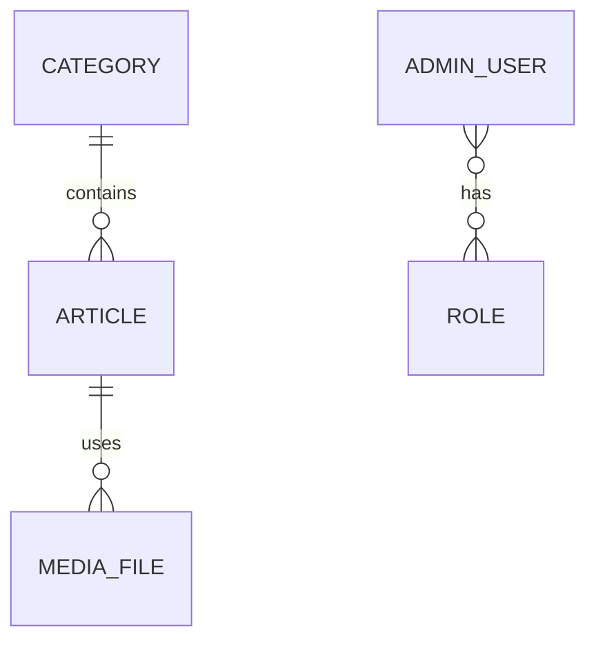

# Задача: анализ frontend-проекта и подготовка плана создания backend-системы и административной панели

Тебе необходимо полностью изучить существующий веб-проект и подготовить подробный технический план его перевода со статических данных на динамическую архитектуру с использованием backend-приложения, базы данных и административной панели.

## Исходные материалы

Я предоставлю один или несколько источников:

* локальный путь к frontend-проекту;
* ссылку на Git-репозиторий;
* ссылку на опубликованный сайт;
* документацию или описание проекта;
* при наличии — ссылку на существующий backend или его API-документацию;
* дополнительные бизнес-требования.

Данные проекта:

* **Frontend-проект:** `https://github.com/stanley-co/landing-web.git`
* **Опубликованный сайт:** `https://kitexp.ru/`
* **Существующий backend/API:** `"ОТСУТСТВУЕТ"`
* **Документация:** `пока нет`
* **Предпочтительный backend-стек:** `Java 21, Spring Boot, PostgreSQL, MinioS3`
* **Дополнительные требования:** ``

Если часть информации отсутствует, не останавливай анализ. Изучи доступный проект и явно зафиксируй все предположения и вопросы в итоговом документе.

---

# Главная цель

Подготовить отдельный Markdown-файл с полным планом разработки backend-проекта, базы данных, API и административной панели, которые позволят:

1. убрать из frontend-проекта статические и захардкоженные данные;
2. хранить управляемый контент в базе данных;
3. получать данные через backend API;
4. редактировать содержимое сайта через административную панель;
5. управлять основными сущностями сайта без изменения исходного кода;
6. безопасно загружать и заменять изображения, документы и другие файлы;
7. обеспечить авторизацию администраторов и разграничение прав;
8. предусмотреть дальнейшее развитие и масштабирование проекта.

На текущем этапе не нужно реализовывать backend или переписывать frontend. Основной результат — глубокий анализ и подробный план будущей реализации.

---

# Правила проведения анализа

## 1. Полностью изучи frontend-проект

Проведи рекурсивный анализ структуры проекта.

Изучи:

* используемый фреймворк и его версию;
* библиотеки и зависимости;
* маршрутизацию;
* страницы;
* layout-компоненты;
* переиспользуемые UI-компоненты;
* формы;
* модальные окна;
* таблицы;
* карточки;
* слайдеры;
* галереи;
* меню;
* футер;
* шапку сайта;
* фильтры;
* поиск;
* пагинацию;
* работу с файлами;
* адаптивную верстку;
* SEO-настройки;
* метаданные страниц;
* локализацию;
* конфигурацию окружений;
* механизм сборки;
* текущие внешние интеграции;
* аналитику;
* обработку ошибок;
* состояние приложения;
* используемые API-клиенты;
* наличие mock-данных;
* тесты.

Не ограничивайся названиями файлов. Изучи логику компонентов и связи между ними.

---

## 2. Составь карту проекта

Для каждой значимой страницы укажи:

* название страницы;
* URL-маршрут;
* файл, в котором она реализована;
* используемые компоненты;
* назначение страницы;
* какие данные она отображает;
* откуда эти данные сейчас поступают;
* какие данные являются статическими;
* какие данные уже загружаются через API;
* какие действия выполняет пользователь;
* какие формы присутствуют;
* какие backend-возможности потребуются;
* должна ли страница управляться через административную панель.

Пример формата:

| Страница | Маршрут | Файлы | Текущий источник данных | Требуемый backend | Управление в админке |
| -------- | ------- | ----- | ----------------------- | ----------------- | -------------------- |

---

## 3. Найди всю текущую статику

Необходимо обнаружить все данные, которые сейчас:

* прописаны непосредственно в JSX, TSX, HTML или шаблонах;
* находятся в JavaScript- или TypeScript-массивах;
* хранятся в JSON-файлах;
* находятся в mock-файлах;
* импортируются из файлов с константами;
* находятся в public/assets;
* дублируются на разных страницах;
* подставляются через переменные окружения;
* загружаются со сторонних ресурсов;
* содержатся в CSS как фоновые изображения;
* хранятся в локальных файлах проекта.

Для каждого блока статических данных укажи:

* точный путь к файлу;
* название компонента;
* пример или описание данных;
* тип данных;
* где данные используются;
* нужно ли переносить их в базу данных;
* к какой будущей backend-сущности они относятся;
* должен ли администратор иметь возможность их менять;
* требуется ли история изменений;
* требуется ли публикация по расписанию;
* требуется ли черновик и предварительный просмотр.

Составь отдельную таблицу инвентаризации статических данных.

Пример:

| Файл | Компонент | Тип данных | Текущее хранение | Будущая сущность | Управление через админку |
| ---- | --------- | ---------- | ---------------- | ---------------- | ------------------------ |

---

## 4. Изучи текущую работу с внешними ресурсами

Найди все сетевые запросы и внешние зависимости:

* `fetch`;
* `axios`;
* API-клиенты;
* GraphQL;
* WebSocket;
* внешние REST API;
* CMS;
* карты;
* формы обратной связи;
* почтовые сервисы;
* аналитические сервисы;
* платежные системы;
* CAPTCHA;
* сторонние изображения;
* CDN;
* облачные файловые хранилища;
* ссылки на социальные сети;
* карты и геолокацию;
* виджеты;
* iframe;
* внешние скрипты.

Для каждого обращения укажи:

* файл и функцию;
* адрес ресурса;
* HTTP-метод;
* параметры запроса;
* формат ответа;
* способ обработки ошибок;
* используется ли авторизация;
* нужно ли сохранить интеграцию;
* нужно ли перенести обращение на backend;
* какие риски существуют.

Если запросы отсутствуют, явно укажи, что проект в настоящий момент работает преимущественно на статических данных.

---

## 5. Определи основные бизнес-сущности

На основании frontend-проекта выдели все сущности, которые должны появиться в backend и базе данных.

Примеры возможных сущностей:

* пользователь;
* администратор;
* роль;
* разрешение;
* страница;
* текстовый блок;
* раздел сайта;
* категория;
* услуга;
* товар;
* проект;
* новость;
* статья;
* событие;
* сотрудник;
* преподаватель;
* отзыв;
* вопрос и ответ;
* контакт;
* филиал;
* документ;
* изображение;
* баннер;
* слайд;
* заявка;
* форма обратной связи;
* настройка сайта;
* SEO-настройка;
* меню;
* пункт меню;
* социальная сеть.

Не копируй этот список автоматически. Выделяй только те сущности, которые действительно следуют из изученного frontend-проекта.

Для каждой сущности опиши:

* назначение;
* поля;
* обязательные поля;
* необязательные поля;
* типы данных;
* ограничения;
* статусы;
* связи с другими сущностями;
* правила удаления;
* необходимость мягкого удаления;
* необходимость сортировки;
* необходимость ручного порядка отображения;
* даты создания и изменения;
* автора изменений;
* поддержку черновиков;
* публикацию;
* архивирование;
* SEO-поля;
* изображения и документы;
* локализацию;
* версионирование.

---

## 6. Спроектируй предварительную структуру базы данных

Подготовь логическую модель базы данных.

Для каждой таблицы укажи:

* название;
* назначение;
* перечень колонок;
* типы данных;
* первичный ключ;
* внешние ключи;
* уникальные ограничения;
* индексы;
* статусы;
* системные поля;
* связи;
* каскадное поведение;
* мягкое или физическое удаление.

Отдельно опиши связи:

* один к одному;
* один ко многим;
* многие ко многим.

Представь модель в удобном текстовом формате или Mermaid ER-диаграмме.

Пример:



Диаграмма должна соответствовать реальным сущностям анализируемого проекта.

---

## 7. Спроектируй backend-модули

Раздели будущий backend на функциональные модули.

Для каждого модуля укажи:

* назначение;
* связанные сущности;
* сервисы;
* репозитории;
* контроллеры;
* DTO;
* мапперы;
* валидацию;
* обработку ошибок;
* права доступа;
* интеграции;
* фоновые задачи;
* события;
* логирование;
* тестирование.

Возможные модули:

* авторизация и аутентификация;
* управление администраторами;
* роли и разрешения;
* управление контентом;
* управление страницами;
* управление медиафайлами;
* заявки пользователей;
* настройки сайта;
* SEO;
* аудит действий;
* уведомления;
* интеграции.

Состав модулей должен быть определен после анализа проекта.

---

## 8. Спроектируй API

Подготовь предварительный список API-методов.

Раздели API на:

1. публичное API для сайта;
2. защищенное API для административной панели;
3. внутренние или системные методы;
4. методы работы с файлами;
5. методы авторизации.

Для каждого endpoint укажи:

* HTTP-метод;
* URL;
* назначение;
* параметры пути;
* query-параметры;
* тело запроса;
* пример ответа;
* коды ответа;
* требования авторизации;
* необходимые права;
* правила валидации;
* возможные ошибки;
* поддержку пагинации;
* фильтрацию;
* сортировку;
* полнотекстовый поиск.

Пример таблицы:

| Метод | URL | Назначение | Доступ | Запрос | Ответ |
| ----- | --- | ---------- | ------ | ------ | ----- |

Необходимо предусмотреть версионирование API, например:

```text
/api/v1/public/...
/api/v1/admin/...
/api/v1/auth/...
```

---

## 9. Подробно спроектируй административную панель

Главная цель административной панели — дать уполномоченным пользователям возможность управлять динамическим содержимым сайта без изменения frontend-кода.

Определи полный список разделов административной панели.

Для каждого раздела опиши:

* название;
* назначение;
* список отображаемых данных;
* таблицу или карточный вид;
* создание записи;
* редактирование;
* удаление;
* архивирование;
* восстановление;
* массовые операции;
* сортировку;
* фильтры;
* поиск;
* пагинацию;
* предварительный просмотр;
* статус публикации;
* порядок отображения;
* работу с изображениями;
* работу с документами;
* правила валидации;
* доступные роли;
* подтверждение опасных операций;
* сообщения об ошибках;
* пустые состояния;
* историю изменений.

Обязательно проработай следующие аспекты.

### Главная страница админ-панели

Опиши dashboard:

* количество опубликованных материалов;
* количество черновиков;
* последние изменения;
* новые заявки;
* ошибки интеграций;
* быстрые действия;
* состояние сайта;
* активность администраторов.

Показывай только те показатели, которые действительно актуальны для проекта.

### Управление контентом

Для каждого типа контента опиши:

* список;
* страницу создания;
* страницу редактирования;
* обязательные поля;
* визуальный редактор;
* изображения;
* файлы;
* SEO;
* публикацию;
* черновик;
* архив;
* предпросмотр;
* порядок отображения.

### Управление медиафайлами

Предусмотри:

* загрузку изображений;
* загрузку документов;
* ограничение типов файлов;
* ограничение размера;
* проверку MIME-типа;
* генерацию уникальных имен;
* превью;
* альтернативный текст;
* поиск неиспользуемых файлов;
* удаление;
* защиту от удаления используемого файла;
* оптимизацию изображений;
* хранение метаданных;
* при необходимости — объектное хранилище.

### Администраторы, роли и права

Опиши:

* вход;
* выход;
* восстановление доступа;
* смену пароля;
* роли;
* разрешения;
* блокировку пользователя;
* журнал авторизаций;
* срок действия сессий;
* защиту от перебора паролей;
* двухфакторную аутентификацию, если она оправдана;
* разграничение доступа к разделам.

### Журнал действий

Предусмотри аудит:

* кто выполнил действие;
* когда;
* над какой сущностью;
* старое значение;
* новое значение;
* IP-адрес;
* тип операции;
* возможность фильтрации.

---

## 10. Определи, какие изменения потребуются во frontend

Необходимо составить план перехода frontend-проекта со статических данных на backend API.

Для каждой страницы или компонента укажи:

* какие статические данные будут удалены;
* какой API-метод будет использоваться;
* где будет находиться API-клиент;
* какие TypeScript-типы потребуются;
* как будет обрабатываться загрузка;
* как будут отображаться ошибки;
* нужен ли skeleton;
* нужен ли retry;
* требуется ли кеширование;
* требуется ли SSR, SSG или клиентская загрузка;
* как будет обрабатываться отсутствие данных;
* какие компоненты необходимо переработать;
* какие компоненты можно оставить без изменений.

Отдельно опиши:

* конфигурацию базового URL;
* переменные окружения;
* разделение development, test и production;
* обработку токенов;
* refresh token;
* CORS;
* единый обработчик ошибок;
* логирование;
* защиту от повторных запросов;
* генерацию или ручное описание API-типов.

---

## 11. Проработай миграцию существующей статики

Опиши, как перенести текущие данные frontend-проекта в базу данных.

Необходимо определить:

* какие данные переносятся автоматически;
* какие данные нужно обработать вручную;
* какие данные дублируются;
* какие данные требуют нормализации;
* какие изображения нужно перенести;
* какие ссылки необходимо заменить;
* какие seed-скрипты потребуются;
* как проверить полноту миграции;
* как избежать потери данных;
* как провести повторную миграцию;
* как откатить миграцию.

Составь таблицу:

| Текущий источник | Тип данных | Целевая таблица | Способ переноса | Проверка |
| ---------------- | ---------- | --------------- | --------------- | -------- |

---

## 12. Безопасность

Подготовь отдельный раздел по безопасности.

Рассмотри:

* хранение паролей;
* JWT или серверные сессии;
* access token и refresh token;
* CORS;
* CSRF;
* XSS;
* SQL Injection;
* rate limiting;
* brute-force protection;
* загрузку файлов;
* проверку MIME-типа;
* максимальный размер файлов;
* права доступа;
* секреты и переменные окружения;
* аудит;
* резервное копирование;
* логирование персональных данных;
* маскирование чувствительной информации;
* безопасные HTTP-заголовки;
* HTTPS;
* защиту административной панели;
* срок жизни токенов;
* отзыв сессий;
* управление ошибками без раскрытия внутренней информации.

---

## 13. Нефункциональные требования

Опиши требования к:

* производительности;
* масштабированию;
* доступности;
* отказоустойчивости;
* кешированию;
* логированию;
* мониторингу;
* резервному копированию;
* восстановлению;
* документации;
* тестированию;
* CI/CD;
* Docker;
* Docker Compose;
* миграциям базы данных;
* конфигурации окружений;
* хранению файлов;
* локальной разработке;
* staging-среде;
* production-среде.

---

## 14. Тестирование

Подготовь стратегию тестирования.

Опиши:

* unit-тесты;
* integration-тесты;
* repository-тесты;
* controller-тесты;
* тесты безопасности;
* тесты авторизации;
* тесты API;
* тесты миграций;
* тесты загрузки файлов;
* frontend integration-тесты;
* end-to-end тесты;
* smoke-тесты;
* проверку ролей и разрешений;
* нагрузочное тестирование критических endpoint;
* тестирование миграции статических данных.

Для ключевых модулей перечисли основные тестовые сценарии.

---

## 15. Инфраструктура и развертывание

Опиши рекомендуемую инфраструктуру:

* frontend;
* backend;
* база данных;
* reverse proxy;
* файловое или объектное хранилище;
* SSL;
* домены и поддомены;
* административная панель;
* API;
* Docker-образы;
* Docker Compose;
* CI/CD;
* миграции;
* резервные копии;
* мониторинг;
* централизованные логи.

Пример возможного разделения:

```text
site.example.ru        — публичный frontend
admin.example.ru       — административная панель
api.example.ru         — backend API
```

Не используй это разделение автоматически. Сначала оцени архитектуру проекта и предложи обоснованный вариант.

---

# Требования к итоговому Markdown-файлу

Создай файл:

```text
BACKEND_AND_ADMIN_IMPLEMENTATION_PLAN.md
```

Если в проекте есть папка `docs`, файл можно разместить в ней:

```text
docs/BACKEND_AND_ADMIN_IMPLEMENTATION_PLAN.md
```

Итоговый документ должен содержать следующие разделы:

1. Назначение документа.
2. Краткое описание текущего проекта.
3. Используемый frontend-стек.
4. Структура frontend-проекта.
5. Карта страниц и маршрутов.
6. Карта компонентов.
7. Инвентаризация статических данных.
8. Текущие внешние запросы и интеграции.
9. Проблемы текущей архитектуры.
10. Целевая архитектура.
11. Основные бизнес-сущности.
12. Предварительная модель базы данных.
13. Backend-модули.
14. Публичное API.
15. API административной панели.
16. Структура административной панели.
17. Роли и разрешения.
18. Управление файлами.
19. Изменения во frontend.
20. Миграция существующих данных.
21. Безопасность.
22. Обработка ошибок.
23. Логирование и аудит.
24. Тестирование.
25. Инфраструктура и развертывание.
26. Этапы разработки.
27. Риски.
28. Открытые вопросы.
29. Критерии готовности.
30. Итоговая оценка объема работ.

---

# Требования к этапам реализации

Раздели будущую разработку минимум на следующие этапы:

## Этап 1. Аудит и фиксация требований

* проверка результатов анализа;
* уточнение бизнес-сущностей;
* согласование ролей;
* согласование контента, управляемого через админку;
* определение MVP.

## Этап 2. Проектирование

* архитектура;
* база данных;
* API;
* безопасность;
* структура административной панели;
* файловое хранилище.

## Этап 3. Создание основы backend

* проект;
* конфигурация;
* миграции;
* обработка ошибок;
* логирование;
* документация API;
* Docker.

## Этап 4. Авторизация и администрирование

* пользователи;
* роли;
* разрешения;
* сессии;
* аудит.

## Этап 5. Реализация контентных модулей

Раздели этот этап на конкретные модули, найденные во frontend-проекте.

## Этап 6. Создание административной панели

* dashboard;
* справочники;
* формы;
* таблицы;
* файлы;
* статусы;
* публикация.

## Этап 7. Интеграция frontend с API

* API-клиент;
* типы;
* загрузка;
* ошибки;
* кеширование;
* замена статических данных.

## Этап 8. Миграция данных

* seed;
* импорт;
* файлы;
* проверка.

## Этап 9. Тестирование

* backend;
* frontend;
* API;
* роли;
* миграции;
* end-to-end сценарии.

## Этап 10. Развертывание

* staging;
* production;
* мониторинг;
* резервное копирование;
* документация.

Для каждого этапа укажи:

* цель;
* список задач;
* зависимости;
* результат;
* критерии приемки;
* риски;
* приблизительную сложность: низкая, средняя или высокая.

---

# Критерии качества анализа

Итоговый документ считается качественным, если:

* он основан на фактической структуре изученного проекта;
* для выводов указаны конкретные файлы и компоненты;
* найдены все основные источники статических данных;
* описаны все значимые страницы;
* выделены реальные бизнес-сущности;
* предложена логичная схема базы данных;
* определены публичные и административные API;
* подробно спроектирована административная панель;
* составлен реалистичный план миграции;
* описаны изменения frontend-проекта;
* учтены безопасность и права доступа;
* этапы можно последовательно передавать разработчику или другому AI-агенту;
* в документе нет общих формулировок без привязки к проекту.

---

# Ограничения

* Не удаляй и не изменяй существующие файлы frontend-проекта.
* Не начинай полноценную реализацию backend.
* Не переписывай компоненты frontend.
* Не добавляй зависимости без необходимости.
* Не придумывай функциональность, которая не следует из проекта или требований.
* Все предположения помечай как предположения.
* Все неизвестные моменты вынеси в раздел «Открытые вопросы».
* Не ограничивайся поверхностным просмотром структуры папок.
* Не составляй универсальный шаблон без привязки к фактическому коду.
* Не пропускай мобильные версии, адаптивные компоненты и скрытые маршруты.
* Не считай текстовые и графические ресурсы незначимыми: они также могут требовать управления через административную панель.

---

# Формат работы

1. Сначала изучи структуру проекта.
2. Затем найди страницы, маршруты и компоненты.
3. После этого проанализируй источники данных.
4. Определи бизнес-сущности и административные функции.
5. Спроектируй целевую архитектуру.
6. Создай итоговый Markdown-файл.
7. В конце ответа кратко укажи:

   * где создан файл;
   * какие разделы проекта были изучены;
   * какие главные сущности были найдены;
   * какие вопросы требуют уточнения.

Не ограничивай объем итогового документа. Он должен быть настолько подробным, чтобы его можно было использовать как техническое задание и пошаговую основу для последующей разработки backend, базы данных, API и административной панели.
